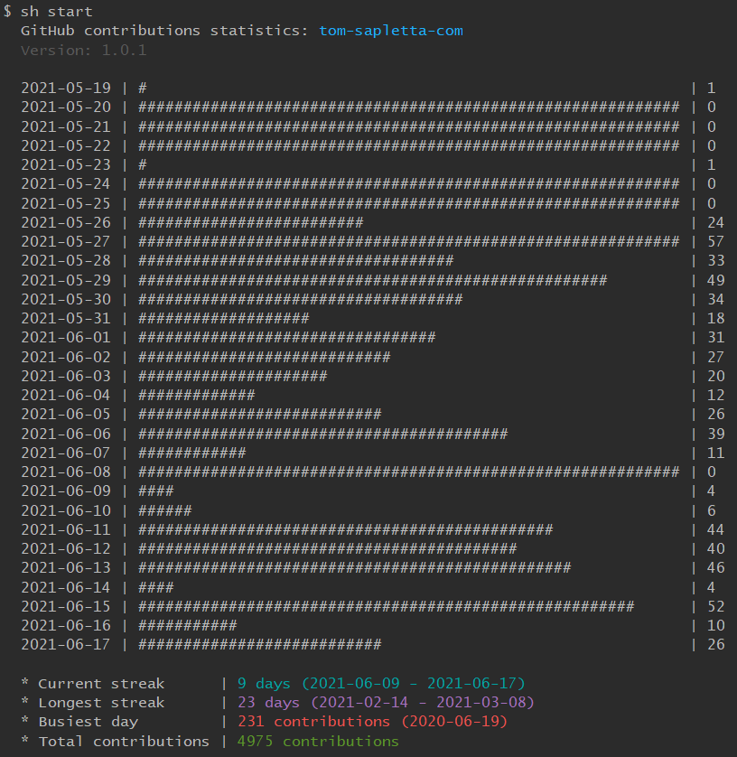

# github-contribution-stats-cli
show github stats



### install

```bash
sh install
```

```bash
npm install -g github-contribution-stats-cli
```

### start


```bash
sh start
```

```bash
github-contribution-stats tom-sapletta-com -d 30
```

---
+ [edit](https://github.com/tom-sapletta-com/github-contribution-stats-cli/edit/main/README.md)
+ [git](https://github.com/tom-sapletta-com/github-contribution-stats-cli)
```
https://github.com/tom-sapletta-com/github-contribution-stats-cli.git
```    
